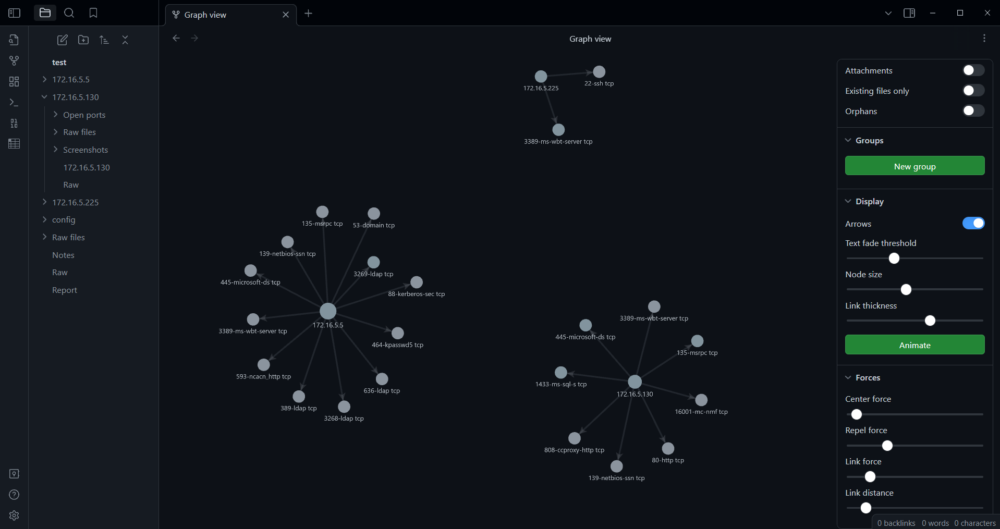

# nmap2obsidian

- Simple script to create folder structure and markdown files based on hardcoded template.
- Intended to use in Obsidian for notes managements during penetration testing and utilizing its visualization features.
- Folders are build based on the nmap scripts results provided in form of xml file
- Additional folders for new hosts or new discovered services can be added to same vault (not implemented yet)
- [python-libnmap](https://github.com/savon-noir/python-libnmap/tree/master) is used for Nmap scans parse

# Examples 
```bash
# Create new Obsidian vault
python .\nmap2obsidian.py --init_vault  --vault_name test
# Import Nmap scan results
python .\nmap2obsidian.py -f .\scan1.xml .\scan2.xml --vault_name test
```
Network visualization in Obsidian:


Tree of created vault:
```poweshell
C:.
|   Notes.md
|   Raw.md
|   Report.md
|
|
+---172.16.5.130
|   |   172.16.5.130.md
|   |   Raw.md
|   |
|   +---Open ports
|   |       135-msrpc tcp.md
|   |       139-netbios-ssn tcp.md
|   |       1433-ms-sql-s tcp.md
|   |       16001-mc-nmf tcp.md
|   |       3389-ms-wbt-server tcp.md
|   |       445-microsoft-ds tcp.md
|   |       80-http tcp.md
|   |       808-ccproxy-http tcp.md
|   |
|   +---Raw files
|   \---Screenshots
+---172.16.5.225
|   |   172.16.5.225.md
|   |   Raw.md
|   |
|   +---Open ports
|   |       22-ssh tcp.md
|   |       3389-ms-wbt-server tcp.md
|   |
|   +---Raw files
|   \---Screenshots
+---172.16.5.5
|   |   172.16.5.5.md
|   |   Raw.md
|   |
|   +---Open ports
|   |       135-msrpc tcp.md
|   |       139-netbios-ssn tcp.md
|   |       3268-ldap tcp.md
|   |       3269-ldap tcp.md
|   |       3389-ms-wbt-server tcp.md
|   |       389-ldap tcp.md
|   |       445-microsoft-ds tcp.md
|   |       464-kpasswd5 tcp.md
|   |       53-domain tcp.md
|   |       593-ncacn_http tcp.md
|   |       636-ldap tcp.md
|   |       88-kerberos-sec tcp.md
|   |
|   +---Raw files
|   \---Screenshots
+---config
|       config.json
|
\---Raw files
    \---Nmap Scan Results
```